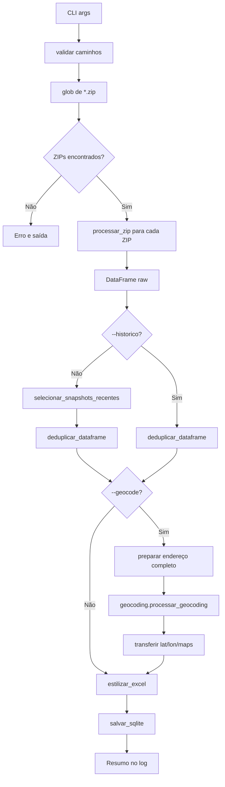

# Knowledge Doc: parse_tim.py

## Overview

**Purpose:** Parser de relatórios de dados cadastrais TIM a partir de arquivos ZIP contendo PDFs.  
**Language:** Python 3.13  
**Type:** Script CLI (executável standalone)  
**Lines:** ~470  

Extrai registros de PDFs de texto selecionável (não requer OCR), gerencia múltiplos snapshots históricos por número de linha, e produz saídas em Excel e SQLite com geocodificação opcional.

---

## Implementation Details

### Fluxo Principal (main)



### Estrutura do ZIP TIM

```
*.zip
└── <protocolo>/
    └── <solicitacao>/
        └── 1_cadastro_<proto>_<sol>_<cpf>_<timestamp>.pdf
```

Cada PDF pode conter múltiplas páginas, e registros podem quebrar entre páginas. Por isso, **todas as páginas são concatenadas** antes do parsing.

### Parsing de PDF

**`extrair_texto_pdf_de_bytes(data: bytes) -> str`**
- Valida magic number `%PDF` antes de processar (mitigação de segurança)
- Usa `fitz.open(stream=data, filetype="pdf")` (PyMuPDF)
- Concatena texto de todas as páginas com `\n`

**`filtrar_linhas(linhas: list[str]) -> list[str]`**
- Remove lixo exato: `""`, `"a"`, `"aa"`, `"CONFIDENCIAL"`, etc.
- Remove headers/footers via regex: números de solicitação, protocolo, TIM S/A, etc.
- **Trunca linhas >4096 caracteres** para mitigar ReDoS
- Retorna lista de strings "stripped"

**`parse_texto_tim(texto, cpf_consulta, arquivo_origem) -> list[RegistroTim]`**
- Divide texto em linhas, filtra, e itera procurando `NÚMERO DA LINHA:`
- Para cada ocorrência, chama `_parse_registro_tim()`

**`_parse_registro_tim(linhas, idx, ...)`**
- State machine simples: detecta labels via regex `^([A-Z...]+):$`
- Próxima linha não-label é o valor
- Valores `.` são convertidos para string vazia (depois mapeados para `None` na dataclass)
- Para no próximo `NÚMERO DA LINHA:` ou fim do texto

### Snapshots Históricos

**Problema:** O mesmo número de linha aparece em múltiplas páginas com datas de cadastro diferentes (registro de alterações no tempo).

**Solução:**
- Modo padrão: `selecionar_snapshots_recentes(df)` mantém apenas o registro com `max(data_cadastro)` por `numero_linha`
- Modo `--historico`: desativa a seleção, mantendo todos os snapshots

### Geocodificação TIM

O geocoding.py espera colunas `endereco`, `bairro`, `municipio`, `estado`, `cep`. A TIM fornece endereço separado em dois campos:
- `endereco_residencial` (logradouro, número, bairro)
- `cidade_uf_cep_residencial` (formato: `CIDADE/UF - CEP`)

O parser concatena os dois campos e extrai sub-campos via `_extrair_cidade_uf_cep()` para compatibilizar com o módulo `geocoding.py` **sem modificá-lo**.

---

## Security Considerations

| Controle | Implementação | Status |
|---|---|---|
| Zip bomb protection | Ratio compressão >100x rejeita ZIP | ✅ Aplicado |
| Max ZIP size | 500MB (total descomprimido) | ✅ Aplicado |
| Max PDF size | 100MB por arquivo | ✅ Aplicado |
| Max PDFs por ZIP | 1000 | ✅ Aplicado |
| Magic number validation | `%PDF` obrigatório | ✅ Aplicado |
| Path traversal sanitization | `Path(nome).name` em logs | ✅ Aplicado |
| Input/output path validation | `resolve()` + absolute check | ✅ Aplicado |
| ReDoS mitigation | Linhas truncadas em 4096 chars | ✅ Aplicado |
| PII in logs | `exc_info=True` removido | ✅ Aplicado |

---

## Dependencies

### Imports internos
```python
import sys
sys.path.insert(0, "../shared")
import geocoding          # tools/shared/geocoding.py
from pipeline import ...  # tools/shared/pipeline.py
```

### Imports externos
```python
import fitz               # PyMuPDF — parsing de PDF
import pandas as pd       # DataFrame
import zipfile            # Leitura de ZIPs
```

### Arvore de chamadas (depth 2)
```
parse_tim.py
├── fitz.open()                [PyMuPDF]
├── zipfile.ZipFile()          [stdlib]
│   ├── _validar_tamanho_zip()
│   └── zipfile.ZipInfo
├── parse_texto_tim()
│   └── _parse_registro_tim()
├── selecionar_snapshots_recentes()
│   └── pd.to_datetime()
├── pipeline.deduplicar_dataframe()
├── pipeline.estilizar_excel()
├── pipeline.salvar_sqlite()
│   └── geocoding.criar_tabela_cache()
└── geocoding.processar_geocoding()
    └── requests.get()         [Nominatim API]
```

---

## Additional Insights

### Limitações Conhecidas
- **Bairro não extraído separadamente:** O endereço TIM não separa bairro em campo próprio. O bairro pode estar em `endereco_residencial` ou omitido. O campo `bairro` enviado ao geocoding é sempre vazio.
- **Falha graciosa:** Se um PDF individual falha, o parser loga erro e continua com os demais
- **CPF fallback:** Se o CPF não é encontrado no texto do PDF, usa regex no nome do arquivo. Isso pode falhar se o nome do arquivo for renomeado

### Performance
- Todos os PDFs são lidos em memória (`zf.read()` + `fitz.open(stream=...)`). Para ZIPs com dezenas de PDFs grandes, o consumo de RAM pode ser significativo.
- Mitigação: limites de tamanho aplicados (FIND-001)

---

## Metadata

- **Date:** 2026-05-18
- **Depth:** 2 (internos + externos)
- **Files touched:** `tools/tim-parser/parse_tim.py`
- **Test coverage:** Nenhum teste unitário dedicado existe na estrutura atual

## Next Steps
- [ ] Criar `tests/test_parse_tim.py` na estrutura de testes
- [ ] Testar comportamento com ZIPs contendo dezenas de PDFs (stress test)
- [ ] Avaliar se bairro pode ser extraído de `endereco_residencial` via heurística
