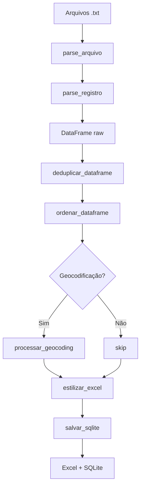

# Knowledge Doc: Parser de Dados Cadastrais Vivo

## Overview

**Entry Point:** `tools/vivo-parser/parse_vivo.py`  
**Language:** Python 3.13  
**Type:** CLI tool / Batch script wrapper  
**Purpose:** Extrair, deduplicar, geocodificar e formatar dados cadastrais de linhas telefônicas Vivo a partir de relatórios em texto (.txt).

Este parser processa arquivos `.txt` contendo relatórios de dados cadastrais da Vivo, extrai registros estruturados, remove duplicatas, ordena por relevância e gera saídas em Excel (formatado) e SQLite (com cache de geocodificação).

---

## Implementation Details

### Core Logic & Execution Flow



### Key Components

#### 1. Parsing de Arquivos (`parse_arquivo`)
- **Input:** Um arquivo `.txt` com relatório Vivo
- **Processo:**
  1. Lê o arquivo inteiro em memória (`read_text`)
  2. Detecta CPF de consulta via regex (`RE_CPF_CONSULTA`)
  3. Detecta início de registro (`RE_NUMERO_DA_LINHA`)
  4. Chama `parse_registro` para extrair campos
- **Output:** Lista de `RegistroVivo`

#### 2. Parsing de Registro (`parse_registro`)
- **Input:** Lista de linhas, índice atual, CPF de consulta, nome do arquivo
- **Processo:**
  1. Itera linhas até encontrar próximo registro ou separador
  2. Extrai campos via regex `RE_CAMPO` (label:valor)
  3. **Endereço multilinha:** Detecta continuação do endereço em linhas subsequentes que não são campos conhecidos
  4. Validação mínima: requer `NÚMERO_DA_LINHA` e `CLIENTE`
- **Output:** Tupla `(RegistroVivo | None, próximo_idx)`

#### 3. Deduplicação (`deduplicar_dataframe`)
- Remove registros idênticos ignorando a coluna `arquivo_origem`
- Mantém o primeiro registro encontrado (`keep="first"`)
- Loga quantidade removida

#### 4. Ordenação (`ordenar_dataframe`)
- Ordena por situação (ATIVO primeiro) e data de habilitação (mais recente primeiro)
- Converte string de data para datetime internamente (colunas temporárias `_data_dt`, `_situacao_ordem`)

#### 5. Geocodificação (`processar_geocoding`)
- **Serviço:** Nominatim (OpenStreetMap)
- **Rate limit:** 1 req/s (apenas após cache miss)
- **Cache:** SQLite em `geocoding_cache` (hash SHA-256 do endereço)
- **Busca em cascata:**
  1. Endereço completo
  2. Sem número/complemento
  3. Logradouro + cidade + estado + Brazil
  4. Apenas cidade + estado + Brazil
- **Normalização:** Remove duplicações de tipo de logradouro ("Rua R " → "Rua ")

#### 6. Estilização Excel (`estilizar_excel`)
- **Cabeçalho:** Fundo azul (`4472C4`), fonte branca, negrito
- **Zebra:** Linhas alternadas cinza (`D9E1F2`) / branco
- **ATIVO:** Fundo verde (`C6EFCE`), fonte verde escuro (`006100`)
- **POS:** Negrito na coluna modalidade
- **Mobile-friendly:** Larguras fixas, wrap text, freeze panes (A2)

#### 7. Persistência SQLite (`salvar_sqlite`)
- **Tabelas:**
  - `linhas_vivo_raw` — todos os registros (com duplicatas)
  - `linhas_vivo` — registros deduplicados
  - `geocoding_cache` — cache de coordenadas
  - `processamento_log` — log de execuções

---

## Data Model

### RegistroVivo (Dataclass)

| Campo | Tipo | Descrição |
|-------|------|-----------|
| `cpf_consulta` | str | CPF usado na consulta ao relatório |
| `numero_linha` | str | Número da linha telefônica |
| `cliente` | str | Nome do cliente |
| `cpf` | str | CPF do cliente no registro |
| `endereco` | str | Endereço completo |
| `bairro` | str | Bairro |
| `cep` | str | CEP |
| `municipio` | str | Município |
| `estado` | str | Estado (UF) |
| `modalidade` | str | PRE / POS |
| `situacao` | str | ATIVO / INATIVO |
| `data_habilitacao` | str | Data no formato DD/MM/YYYY |
| `data_rescisao` | str \| None | Data de rescisão (se houver) |
| `arquivo_origem` | str | Nome do arquivo .txt de origem |

### Schema SQLite

#### linhas_vivo_raw / linhas_vivo
Todas as colunas do RegistroVivo como campos TEXT (exceto data_rescisao que pode ser NULL).

#### geocoding_cache
| Coluna | Tipo | Descrição |
|--------|------|-----------|
| `endereco_hash` | TEXT PRIMARY KEY | Hash SHA-256 do endereço completo |
| `endereco_completo` | TEXT | Endereço em texto plano (PII) |
| `latitude` | REAL | Latitude |
| `longitude` | REAL | Longitude |
| `google_maps_url` | TEXT | URL de direções do Google Maps |
| `data_consulta` | TIMESTAMP | Data/hora da consulta |

#### processamento_log
| Coluna | Tipo | Descrição |
|--------|------|-----------|
| `id` | INTEGER PRIMARY KEY | ID auto-incremental |
| `data_processamento` | TIMESTAMP | Data/hora da execução |
| `total_registros` | INTEGER | Total de registros raw |
| `total_registros_dedup` | INTEGER | Total após deduplicação |
| `arquivo_db` | TEXT | Caminho do arquivo .db |

---

## Dependencies

### Internal
| Módulo | Origem | Função |
|--------|--------|--------|
| `pipeline` | `tools/shared/pipeline.py` | Deduplicação, ordenação, estilização Excel, SQLite |
| `geocoding` | `tools/shared/geocoding.py` | Geocodificação Nominatim + cache |

### External
| Pacote | Versão | Uso |
|--------|--------|-----|
| pandas | >=2.0.0 | DataFrame, deduplicação, ordenação |
| openpyxl | >=3.1.0 | Geração e estilização Excel |
| requests | >=2.30.0 | HTTP para Nominatim |

---

## Security Considerations

- **PII em todos os arquivos:** Entrada (.txt), saída (.xlsx, .db) e cache contêm CPFs, nomes e endereços
- **Path traversal:** Mitigado via `_validar_caminho()` que resolve paths absolutos e rejeita `..`
- **Cache exposto:** `geocoding_cache` armazena endereços completos em texto plano — proteger o arquivo .db
- **User-Agent Nominatim:** Identifica o parser — não expõe credenciais (Nominatim não requer API key)

---

## CLI Interface

```bash
python tools/vivo-parser/parse_vivo.py --input "pasta/txts" --output "pasta/saida"
```

| Flag | Descrição |
|------|-----------|
| `--input` | Pasta com arquivos `.txt` (obrigatório) |
| `--output` | Pasta de saída (obrigatório) |
| `--no-geocode` | Desativa geocodificação (mais rápido) |

---

## Batch Script (Usuário Leigo)

`tools/vivo-parser/Processar Dados Vivo.bat`
- Verifica Python instalado
- Instala dependências automaticamente se necessário
- Abre seletor de pasta nativo do Windows (PowerShell)
- Executa parser e abre pasta de saída

---

## Error Handling

| Cenário | Comportamento |
|---------|--------------|
| Arquivo .txt inválido | Log de erro, continua processando outros |
| Path traversal detectado | Erro fatal com mensagem clara |
| Nenhum .txt encontrado | Erro logado, encerra |
| Falha na geocodificação | Registra `None` para lat/lon/url, continua |
| Registro sem campos obrigatórios | Retorna `None`, pula registro |

---

## Performance Notes

- **Memória:** `read_text()` carrega arquivo inteiro — OK para arquivos < 10MB
- **Geocodificação:** ~1.5 min para 90 endereços (1 req/s + cache)
- **Cache hit:** Reexecução com mesmos dados é instantânea
- **Deduplicação:** O(n) com pandas `drop_duplicates`

---

## Test Suite

### Unit Tests (`tools/shared/tests/test_parse_vivo.py`)
- 10 testes cobrindo regexes, parsing de registros, deduplicação, ordenação, estilização Excel e geocoding
- Todos passando

### Integration Tests (`tools/shared/tests/test_integration.py`)
- 15 testes end-to-end cobrindo:
  - Pipeline completo com arquivo .txt real
  - Arquivos vazios
  - Deduplicação entre múltiplos arquivos
  - Ordenação por data descendente
  - Excel com colunas de geocoding
  - Cache hit (sem requisição HTTP)
  - Falha de geocodificação
  - Variações de endereço (cascata)
  - **Segurança:** path traversal, paths relativos, validação de existência
  - Registros com endereço multilinha
  - Blocos sem registros
- Todos passando

**Total: 25/25 tests passing**

---

## Next Steps

- [x] Adicionar testes de integração com arquivo .txt real
- [ ] Implementar logging estruturado (JSON) para auditoria
- [ ] Avaliar substituição do Nominatim por OpenCage para maior precisão
- [ ] Adicionar validação de CPF (módulo `validate-doc-br`)
- [ ] Criar parser para outros formatos (TIM, Claro) reutilizando `pipeline.py`
- [ ] Criar CHANGELOG.md e tag de release v2.0.0

---

## Metadata

- **Date:** 2026-05-18
- **Depth:** Full (entry point + dependencies depth 2)
- **Files touched:** `parse_vivo.py`, `pipeline.py`, `geocoding.py`, `Processar Dados Vivo.bat`, `test_parse_vivo.py`, `test_integration.py`
- **Tests:** 25/25 passing (10 unit + 15 integration)
