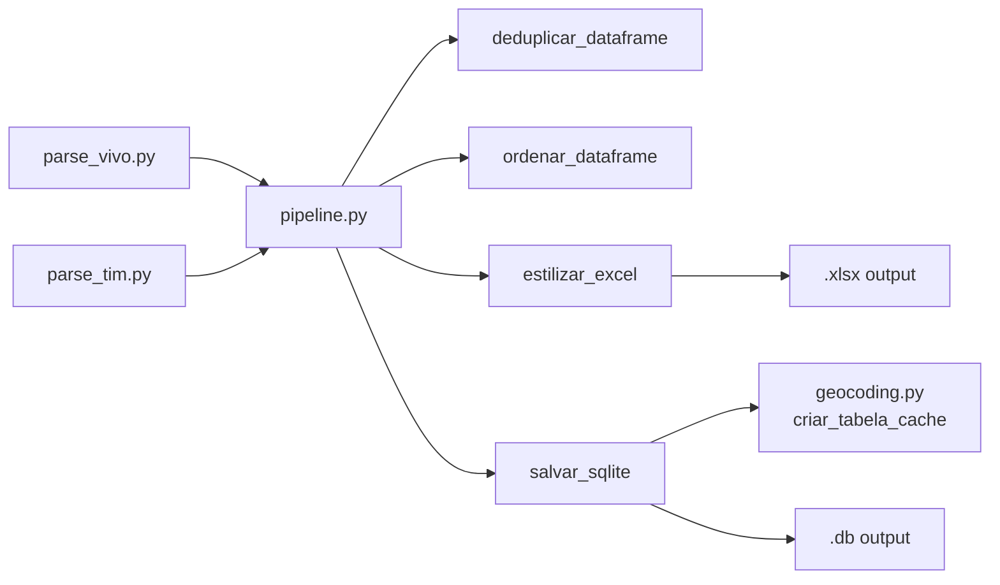

# Knowledge Doc: pipeline.py

## Overview

**Purpose:** Pipeline genérico compartilhado entre os parsers de dados cadastrais (Vivo e TIM).  
**Language:** Python 3.13  
**Type:** Biblioteca/utilitário (não é executável standalone)  
**Lines:** ~204  

Fornece quatro operações de alto nível usadas por ambos os parsers:
- `deduplicar_dataframe()` — remove registros duplicados
- `ordenar_dataframe()` — ordena por situação (ATIVO primeiro) e data descendente
- `estilizar_excel()` — gera planilha Excel com estilos visuais (zebra, destaque ATIVO, negrito POS)
- `salvar_sqlite()` — persiste DataFrames raw e deduplicado em SQLite com log de processamento

---

## Implementation Details

### deduplicar_dataframe

```python
deduplicar_dataframe(df: pd.DataFrame, ignore_cols: list[str] | None = None) -> pd.DataFrame
```

- Usa `pandas.DataFrame.drop_duplicates()` com `keep="first"`
- Por padrão, ignora a coluna `arquivo_origem` (permite que o mesmo registro vindo de arquivos diferentes seja considerado duplicata)
- Loga quantos registros foram removidos

**Edge cases:**
- Se `ignore_cols` contiver colunas que não existem no DataFrame, elas são simplesmente ignoradas (comportamento seguro)
- DataFrame vazio retorna DataFrame vazio

### ordenar_dataframe

```python
ordenar_dataframe(
    df: pd.DataFrame,
    col_situacao: str = "situacao",
    col_data: str = "data_habilitacao",
    data_format: str = "%d/%m/%Y",
) -> pd.DataFrame
```

- Cria colunas temporárias `_data_dt` (parse de data) e `_situacao_ordem` (0=ATIVO, 1=outros)
- Ordena por `[_situacao_ordem, _data_dt]` com `[True, False]`
- Remove as colunas temporárias antes de retornar
- Não modifica o DataFrame original (faz `.copy()`)

**Limitação:** O parsing de data usa `pd.to_datetime` com `errors="raise"` dentro de um try/except; datas inválidas retornam `None` e ficam no final da ordenação.

### estilizar_excel

```python
estilizar_excel(
    df: pd.DataFrame,
    excel_path: Path,
    col_situacao: str = "situacao",
    col_modalidade: str = "modalidade",
    larguras: dict[str, int] | None = None,
) -> None
```

- Usa `openpyxl.Workbook` diretamente (não via pandas ExcelWriter)
- Escreve linha por linha com `dataframe_to_rows`
- Aplica estilos condicionais:
  - Header: fundo azul (`4472C4`), fonte branca negrito
  - Linhas ATIVO: fundo verde (`C6EFCE`), fonte verde escura (`006100`)
  - Outras linhas: zebra (branco/cinza `D9E1F2`)
  - Modalidade POS: negrito (preserva cor da fonte se já for verde)
- Larguras de coluna pré-definidas em dicionário; aceita override via `larguras`
- Congela primeira linha (`freeze_panes = "A2"`)

**Performance:** Para DataFrames grandes (>10k linhas), escrever celula por celula via openpyxl é O(n*m) e pode ser lento. Atualmente não é gargalo (datasets <1k registros).

### salvar_sqlite

```python
salvar_sqlite(
    df_raw: pd.DataFrame,
    df_dedup: pd.DataFrame,
    db_path: Path,
    tabela_raw: str = "linhas_raw",
    tabela_dedup: str = "linhas",
) -> None
```

- Conecta ao SQLite via `sqlite3.connect()`
- Usa `pandas.DataFrame.to_sql(if_exists="replace")` — **destrói tabelas existentes**
- Garante tabela `geocoding_cache` existente chamando `geocoding.criar_tabela_cache()`
- Cria `processamento_log` com INSERT de metadados (timestamp, contagens, path do DB)

**Nota de segurança:** `to_sql` gera SQL parametrizado internamente; não há risco de SQL injection via conteúdo do DataFrame.

---

## Dependencies

### Imports internos
```python
import geocoding          # tools/shared/geocoding.py
```

### Imports externos
```python
import pandas as pd              # DataFrame, to_datetime, to_sql
from openpyxl import Workbook    # Geracao de Excel
from openpyxl.styles import ...  # Estilos visuais
from openpyxl.utils.dataframe import dataframe_to_rows
```

### Arvore de chamadas
```
pipeline.py
├── geocoding.criar_tabela_cache()        [salvar_sqlite]
├── pandas.DataFrame.drop_duplicates()    [deduplicar_dataframe]
├── pandas.to_datetime()                  [ordenar_dataframe]
├── openpyxl.Workbook()                   [estilizar_excel]
└── pandas.DataFrame.to_sql()             [salvar_sqlite]
```

---

## Visual Diagram



---

## Additional Insights

### Segurança
- **Sem validação de path** nos parâmetros `excel_path` e `db_path` — quem chama é responsável por validar (adicionado em parse_tim.py e parse_vivo.py)
- **`to_sql(if_exists="replace")`** destrói dados anteriores sem backup — comportamento intencional, mas documentar para usuários

### Melhorias Futuras
- [ ] Adicionar `tempfile` para escrita atômica do Excel (evita arquivo corrompido se o processo for interrompido)
- [ ] Suportar streaming para DataFrames muito grandes (atualmente tudo em memória)
- [ ] Cache de estilos openpyxl para reutilização

---

## Metadata

- **Date:** 2026-05-18
- **Depth:** 2 (imports externos + chamadas internas)
- **Files touched:** `tools/shared/pipeline.py`
- **Test coverage:** Indireto via `tests/test_parse_vivo.py` (testa dedup, ordenação, Excel)

## Next Steps
- [ ] Criar testes unitários dedicados para `pipeline.py` (hoje são testados indiretamente)
- [ ] Avaliar performance de `estilizar_excel` para datasets >10k registros
